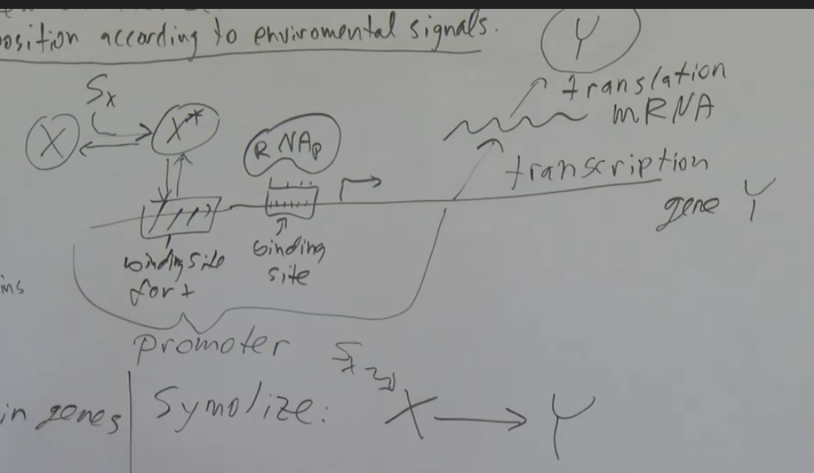

# Lecture 1

- 13:30: “Proteins are built as machines that can transition between
  states”
- E coli changes its composition according to its environment, how
  does it compute when to make a protein?
    - RNAp binds, transcribes to mRNA, which is translated into a
      protein.
    - Proteins called transcription factors represent the external
      environment internally to the cell.
    - transcription factors regulate transcription
    - “the cell has 300 degrees of freedom”
    - transcription factors have specific binding sites and when they
      bind, it “increases the probability” that the RNAp will do its
      thing.
        
      
        
      We use $X \to Y$ to symbolize this entire interaction.
        
- This happens across several orders of magnitude in terms of
  timescales. The binding of a transcription factor to an
  environmental trigger is µs, TF to binding site is seconds,
  translation and transcription is minutes and finally, making it to
  “functional volume” is hours.
- The transcription factor binding site can, in humans, have as many
  as 20 TFs bound there, and the result of the binding is a
  probabilistic logic program.
- 31:40 “When you collect all the arrows, you get a graph.” GRN: Gene
  Regulation Network
- 34:42 “Evolution didn’t go to engineering school, but it still has
  understandable features”
    - In this he was talking about how when engineers build a system,
      they build it out of small parts that they
      understand. Apparently evolution did the same thing, regardless
      of its need to be understandable post facto. This was commentary
      on the fact that the parts are the same, designed for reuse
      across most species. This seems profound on its face, but the
      truth is that it is really they they are descendant from the
      same ancestors—single celled organisms, literal prototypes—of
      the massively complex multi-cellular organisms of today.
    - E coli’s order is ~4500, while $|E|$ is ~10,000.
- The **input function** plots, given an $X \to Y$, the rate of $Y$
  production given a certain $X^*$ concentration?
    - $X^*$ denotes the “activated” version of $X$, $\beta$ is max
      value / concentration, $K$ is 50% activity / concentration and
      $n$ is the “steepness” of the hill function, when $N = 1$, this
      function is linear, when it’s $\infty$, it’s a step function.
    - $n$ is typically between 1 and 4.

$$
\cfrac{\beta (X^{\*})^n}{K^n+(X^{\*})^n}
$$

- When a gene is bound by two TFs, it is a product of hill functions,
  but works like a AND or OR gate. Apparently we don’t know how to
  “systematically look at them”.
- Synthetic biology
- “circuits”—subgraphs of the larger network within a cell.
- A proteasome cuts a protein back up into amino acids.

$$
\cfrac{dy}{dt} = \beta - \alpha y
$$

- This is for a function $x \to y$, where $\beta$ is the rate of
  production of $x$, i.e., “signal”, and $\alpha$ is the rate of
  degradation. this can be done via dilution or by direct degradation,
  via proteasomes.
    - In a steady state, $\cfrac{dy}{dt}$ is $0$, so $\beta - \alpha y = 0$,
	  so you have $\cfrac{\beta}{\alpha}$—production over removal.
- response time is dependent only on removal rate, there is math to
  explain this but I don’t understand it yet. He uses $e$ in the
  equations and mentions an eigenvalue, but I don’t know what that is.
    - High response time is given by high removal, but this is
      expensive.
    - production of half the steady state of proteins is 1 generation,
      meaning that the cell reach steady state only to divide to give
      those proteins to its descendants. This problem will be the
      topic of the next lecture.
